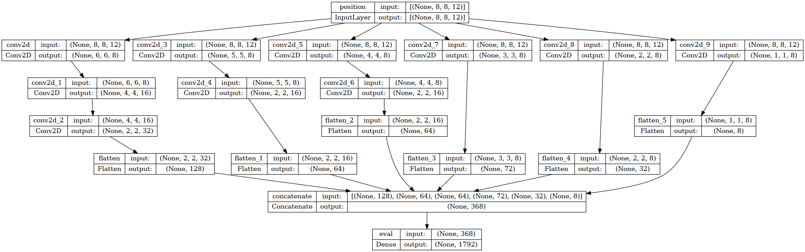

# Chess Engine with Neural Network

## Motivation

It is inspired by TCEC Season 14 - Superfinal, where Leela was trying to fry Stockfish. [Stockfish](https://stockfishchess.org/) is chess engine that dominates among publicly available engines since 2014. Stockfish uses classic approach of chess engines, where everything is determined by algorithms built into engine. [Lc0 aka Leela Chess Zero](http://lczero.org/) is different, since it uses some sort of trainable neural network inside, as well as appealing human-like nickname. Mid-series, Leela managed to take the lead by 1-2 points, and there is a chance NN-powered chess engine will finish heuristics-based dominance (78/100 games played so far).

I wanted to demonstrate my 7yr-old daughter that making these computer chess players are not as hard. We drew a diagram of playing and learning with NN and I started implementing it. The idea is to have practice and fun, make own mistakes, have discussions with daughter about planning and decision making. 

I understand there is ton of research done for centuries on all of the things I say below, I deliberately choose to make my own research for the fun of it.

## Diagram

## Neural Network Structure:

## Journal

### Feb 15, 2019
First commits of the code.
Using own representation of chess board as 8 * 8 * 12 array of 1/0 values. 1/0 are used as most distinctive input for NN about piece presence at certain square. NN uses two hidden layers 64 nodes each. Output of NN is 8 * 8 array for "from cell" and 8 * 8 array for "to cell" scores. A piece of code is used to choose best move that a) is by chess rules; b) has best score of "from" multiplied by "to" output cells. Finally, board state is checked for game end conditions of checkmate or 50-move rule.

Two copies of NN are used, one plays as White and one as Black, playing versus each other. Game is recorded as PGN file, to be able to review it by human.

### Feb 16, 2019
Daughter decided that both NN copies urgently need girl-ish names. White is Lisa, black is Karen.
I decided that writing chess rule checking and move validation is not the goal of this project. Threw away my code for it, in favor of [python-chess](https://python-chess.readthedocs.io/en/latest/) library. This shortened code x3 times.

Engines are playing with each other, after each game they take move log and NN learns from it, assuming *all moves of lost game were bad, all moves of won game are good*, moves from draw are slightly bad (to motivate them search for better than draw).

A web UI is added along with small API server to be able to play with White versus Karen, to try her. Lisa vs Karen are left to play with each other and learn overnight.

### Feb 17, 2019
They played 12700 games overnight. Watching their game recordings shows they are doing a lot of dumb moves with same piece back and forth, making no progress unless they approach 3-fold or 50-move, when program forces to discard drawish move.

It seemed that it's deeply wrong to teach NN that any move from victorious game is good. I wanted to avoid this originally, but to make progress, we need to introduce some sort of *position evaluation*, so engine will learn to tell good moves from bad moves.

With daughter, we outlined some rules of evaluating position:
1. Pieces have different value
2. Capturing enemy piece is very good
3. Attacking enemy piece is good
4. Putting yourself under attack or removing defence from your piece is bad
5. Increasing squares under our control is good
6. Moving pawn forward is slightly good as it is the way to promote

We started with material balance, taking possible square control as value of the piece: 
 - Pawn: 1
 - Knight: 8
 - Bishop: 13
 - Rook: 14
 - Queen: 27
 - King: 64 - special value to reflect it's precious

Since we analyze game after all moves are done, we judge move by what was the consequence after opponent's move. We calculate sum of all our piece values, subtracting all enemy piece values, so we get *material balance*. Learning for ~3000 games shown that NNs definitely learn to capture pieces a lot, so the principle of evaluation works and reflects into NNs move score predictions. Material balance addresses #1, #2 and #3 of our evaluation rules.

Next is to take *mobility* into account, to cover rules #3, #4, #5, #6 from above list. It is quite easy to implement, again we take state after opponent's move and we look now many moves can we make versus how many moves are there for opponent. Attacks are counted in a similar way, we assume that if piece is under attack, it adds *half* of its value to mobility score. This gives us "mobility balance".

Now it gets tricky, since we need to combine material balance and mobility balance to get overall score for position. Current solution is to multiply material balance by 10 and sum with mobility balance. Gut feeling tells me it's not right, but let's see what NN will learn.

Bots are left to play overnight again.

### 18 Feb, 2019

They've played ~32000 games. Quick game versus Karen shows that still NN miss obvious attacks and loses after human quickly. But this time it does a lot more captures, moves pieces more consistenly forward, does less "dumb cyclic moves".

Watching games of Lisa vs Karen shows consistent pawn promotions and a lot of captures from both sides. Still most of obvious attacks, exchanges are missed. End game is completely dumb, falling into cyclic moves still.

I did series of experiments with NN structure, looking if making it deeper or wider would help. But ~10000 games shows that neither 3-layer, nor 128-node NN does better. 

It's time to summarize what was done over past days:
  - building this kind of NN-driven test engine is super-easy
  - the rules we put as criteria for learning do affect engine move making
  - we should research/experiment with evaluation approach more
  - we should experiment with NN structure more, maybe use LSTM instead of feed-forward
  - re-learning from last N games might be better than incremental learning from very last game
  - turning game representation to "always one side" and using exactly same NN for game might make it more robust and universal

### 22 Feb, 2019

Decided to make sing NN that will be able to decide for both sides, using board and move flip for black.

NN structure changed to 6-layers decreasing from 768 to 128 nodes. This increased number of trainable parameters 100x times. It went back to learn games with a lot of dumb moves.

### 23 Feb, 2019

I tend to change my mind back. Actually, my program is just "what is the best move from current position" solver. It has no tree search part (intentional!), and it's wrong for NN to learn moves as good just because they are part of winning game. The score of move is mere measure of if it has changed position in our favor. At first, I want to get NN that will not do stupid mistakes.

### 24 Feb, 2019

Life of developer: was debugging code to understand why my accuracy metric of NN move quickly reaches 1.0 and stayes there. Found that I used wrong data type for numpy array, it was rounding my floats into ints. :facepalm:

### 25 Feb, 2019

Still nothing leads to learning good moves. Experimenting with various scores for moves. Cyclic moves demonstrate lack of depth. I revised the criteria for good move, made NN deeper and made it to learn by batches of 10 games. Let's see...

### 4 Mar, 2019

 Thinking of crystallizing "just next move predictor NN" more. For that, I'll save dataset of all moves generated through learning, and will always learn from this big set. Previous results from multilayer NN were worse than 2-layer, will get back to 2-layer for now.
 
 I feel the trick to teach this variant of NN is to find correct board state representation, so NN will naturally learn.

### 13 Mar, 2019

I made many experiments yesterday, trying to figure out why NN still suggests dumb moves. One good thing I found is that feeding only good moves into learning process improves the NN accuracy in training, which actually makes sense. Still, the accuracy of "move from" output of NN is much better than "move to". In fact, we need "move to" as most valuable output.

### 16 Mar, 2019

Found that moves in training dataset were not unique. God knows how that was affecting learning process for NN... Also found out that material balance score were inverted for black, also affecting NN training scores. Good to find this, it gives me hope that it is possible to build NN like I want.

Big problem is dataset balancing. Moves tend to use kings more, which leads NN to learn to move kings more. Trying to re-balance learning sample weights did not help.

No matter what I did, the best accuracy I get from NN is 0.5, which is equal to random. I will try to go back to principle of "all moves from won game are good" to research it again.

### 30 Mar, 2019

I see that "noisy moves" from draws affect NN learning in a bad way. Same for pointless moves along games with victories. Those moves don't lead to victory as much. So maybe if learning moves for NN would be chosen more selectively, it would help. Will try it in the morning (00:27 now)...

Well, I experimented whole day and the result didn't change. Still stupid moves.

### 14 Apr 2019

OpenAI has beaten humans in Dota2. This world is doomed. Let's not postpone the unavoidable, I need to find my way to make this chess engine at least a bit smart.
Current idea is to introduce "intermediary goals" of "possible moves", "attacks", "threats" as auxillary output layers. Maybe even "defended pieces". Let's see if NN can learn these simple position analysis concepts.

... so, after day of coding, I've implemeted this approach. It is not clear if it is viable or not yet. The good outcome is that I've found a number of severe bugs and fixed them. Those bugs happened because of "single NN for both White and Black", a lot of confusion is there in the code to juggle sides. Cool thing is now I have visualization for model outputs. It will train overnight, though I don't expect outstanding results.

### 15 Apr 2019

After night of training, it has reached  slightly above 50% accuracy for choosing moves, but that's not much, since there are lots of repetitions and overall quality of moves is low. Still, it is better than what we had in the past.

### 16 Apr 2019

I'll experiment today's evening with two things: a) simplify the NN back to just inputs and outputs, with no aux outs; b) train with only victories and with score increasing from 0 to 1 the closer move to the end of game.

... I need to understand how to avoid repetitions. The problem is that naturally NN falls into local optimums and suggest moves back and forth. One can't expect from this kind of non-temporal NN to work differently. So there should be a mechanism to avoid repetitions. Search tree is not an option, again. Just because whole idea of this engine is to avoid search tree.

### 18 Apr 2019

Doing several experiments:

- Removing 3-fold repetition moves from learning data. Those moves are still present in the games, but learning input is nog garbaged by them.
- Added "eval" output of NN, teaching it to evaluate win chance of the game. Game start with each player having 0.5 and then loser gets to 0.0 while winner gets to 1.0.
- Playing back and forth with aux outputs of NN. They're still in question.

Also figured out my residual unit were increasing of size with each level. Reworked that to constant size of 8 * 8 * 12 (initial inputs)

### 27 Jul 2019

Let me take some rest from working for new startup. Starting to change the code with following thoughts:

- Having 2 outputs 8x8 is somehow hard to train. Let's train 64*64=4096 possible moves output 
- Let's switch to [Chess960 aka Fischerandom](https://en.wikipedia.org/wiki/Chess960) for better training variety, since it is generalization over classical Chess
- Still no good solution for 3-fold and 50-move avoiding
- for now, model's structure will get back to 2-layer dense, to speed up experiments
- reading [article](https://towardsdatascience.com/how-to-teach-an-ai-to-play-games-deep-reinforcement-learning-28f9b920440a) about Q-Learning, maybe the learning strategy should change...

Found out that training data were using positions _after_ move made as source of training. Oh, my...
Fixing that seems helped learning a ton. Shame on me for overlooking this since the very beginning.

I also made integration with UCI and now my NN plays versus Stockfish. Loses 100% of games, of course. Let it play with SF overnight...

... it played 5000 games and dozens of re-trainings, but did not improve. I'll need to experiment more, still I see one important bug fixed.

### 17 Aug 2019

I have interesting thought. Chess board position is effectively an image. 8x8 pixels with 12 channels. So can we apply convolutional NN to analyze this image?

I've build a NN structure that uses convolutional layers with additional route of data fed into dense layers, and now experimenting with hyperparams and training.

... it played tens of thousands of games vs SF in "retrain with last game" mode, reached only 0.47 accuracy. But I already know there is one more problem with training data, black moves were not flipped properly. Figured it out in my head just before going to sleep. 

### 18 Aug 2019

I fixed that issue with move flipping, will see how it affects the model. Looks like learning rate has improved a bit.

After some training, I see that NN does not give good moves vs SF. Will train it more.

After some more training, it has approached a bit over 0.5 accuracy, probably for the first time from all my attempts. It's all less about NN structure, it's mostly about stupid bugs in complicated code.

Still after massive training done, accuracy is barely above 0.5. Will need to experiment with NN structure now, I guess.